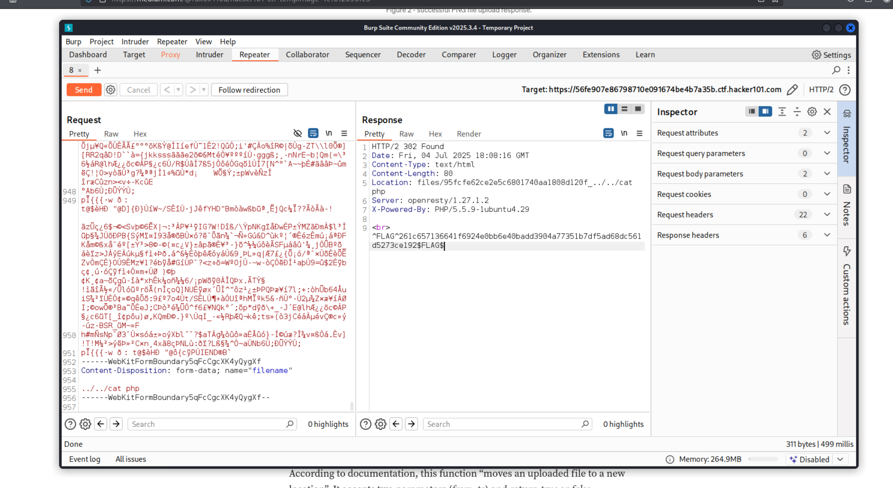
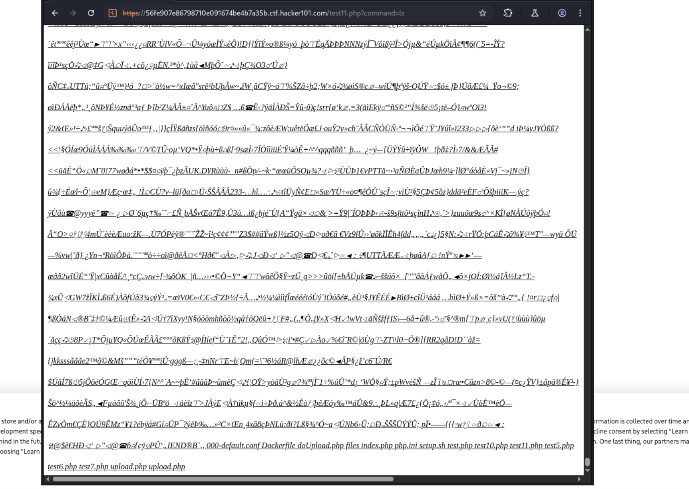

# TempImage
**Difficulty:** Moderate  
**Category:** Web  
**Flags:** 2/2 ✅

---

## 🧠 Thought Process
When I first accessed the TempImage application, I immediately noticed several key characteristics that suggested potential attack vectors. The application appeared to be an image upload service with specific requirements and processing mechanisms.

Initial observations:
- The application uses **PHP** as the backend technology
- Only **PNG files** are accepted for upload
- Uploaded images are renamed using **MD5 hashing**
- Similar to challenges I've encountered on picoCTF involving PHP file upload exploitation

Based on these observations, I suspected this would involve exploiting the file upload functionality to achieve remote code execution, similar to previous CTF challenges where image uploads could be manipulated to execute server-side code.

---

## 🔍 Step 1: Initial Reconnaissance
I started by exploring the application's upload functionality and understanding how it processes files. The application seemed straightforward - users could upload PNG images which would then be processed and stored on the server.

Key findings:
- Strict file type validation (PNG only)
- MD5 hash naming convention for uploaded files
- PHP backend processing
- Potential for file traversal vulnerabilities

---

## 🚩 Step 2: First Flag - Path Traversal Attack
Following my initial analysis, I suspected that the file upload mechanism might be vulnerable to path traversal attacks. I decided to use Burp Suite to intercept and modify the upload requests.

**Discovery Process:**
1. Set up Burp Suite to intercept HTTP requests
2. Attempted to upload a legitimate PNG file
3. Captured the request in Burp Suite's Proxy
4. Modified the request in the Repeater tab
5. Changed the filename parameter to exploit path traversal

**Exploitation:**
In the Repeater tab, I modified the filename parameter to:
```
../../cat php
```

This path traversal payload successfully bypassed the application's file handling logic and revealed the first flag.



### 🔬 Technical Explanation: Path Traversal Vulnerability

This vulnerability occurs when applications fail to properly validate file paths, allowing attackers to:
1. **Directory Traversal:** Navigate outside intended directories using `../` sequences
2. **File Access:** Access files outside the web root or restricted areas
3. **Information Disclosure:** Read sensitive files like configuration files or source code

---

## 🔐 Step 3: Second Flag - PHP Web Shell Upload
After successfully exploiting the path traversal vulnerability, I realized that a more sophisticated approach was needed for the second flag. Drawing from similar picoCTF challenges, I decided to attempt uploading a PHP web shell disguised as a PNG file.

**Approach:**
1. Create a malicious PHP file that appears to be a PNG
2. Use path traversal to place the file in an executable location
3. Access the uploaded PHP file to execute commands
4. Enumerate the server to find the second flag

**Web Shell Creation:**
I crafted a PHP web shell payload and prepared to upload it while bypassing the PNG file restriction.

**Upload Process:**
1. Prepared a PHP file with web shell functionality
2. Used Burp Suite to intercept the upload request
3. Modified the request to include path traversal: `/../../test.php`
4. Successfully uploaded the PHP file to the server


### 🔬 Technical Explanation: File Upload Bypass

This attack combines multiple techniques:
1. **File Type Bypass:** Circumventing file extension restrictions
2. **Path Traversal:** Placing files in executable directories
3. **Web Shell Deployment:** Creating persistent backdoor access
4. **Remote Code Execution:** Executing arbitrary commands on the server

---

## 🎯 Step 4: Remote Code Execution and Flag Discovery
With the PHP web shell successfully uploaded, I could now execute commands on the server remotely.

**Command Execution:**
I accessed the uploaded PHP file and appended command parameters:
```
?command=ls
```

This allowed me to list the contents of the server directory and identify potential files containing the second flag.



**Flag Discovery:**
After enumerating the server files, I used the `cat` command to read various files:
```
?command=cat index.php
```

By examining the source code of `index.php`, I discovered the second flag embedded in the code.


---

## 🏁 Captured Flags
- **Flag 1:** ✅ Obtained through path traversal attack on file upload
- **Flag 2:** ✅ Obtained through PHP web shell and source code analysis

---

## ✅ Summary
This challenge demonstrates several critical web application vulnerabilities commonly found in file upload functionality:

### Discovered Vulnerabilities:
1. **Path Traversal:** Inadequate validation of file paths allowing directory traversal
2. **File Upload Bypass:** Insufficient file type validation and filtering
3. **Remote Code Execution:** Ability to upload and execute malicious PHP files
4. **Information Disclosure:** Access to sensitive source code and configuration files

### Security Implications:
- **Complete System Compromise:** Web shell access provides full server control
- **Data Breach:** Access to sensitive files and potential database information
- **Lateral Movement:** Potential for further network penetration
- **Service Disruption:** Ability to modify or delete critical files

### Root Causes:
- **Insufficient Input Validation:** Lack of proper file path sanitization
- **Weak File Type Checking:** Client-side or easily bypassed validation
- **Missing Security Headers:** No protection against file execution
- **Inadequate Access Controls:** Files uploaded to executable directories

---

## 🛠️ Tools Used
- **Burp Suite** - For request interception and modification
- **Web Browser** - For accessing the web shell and executing commands
- **Manual Testing** - For discovering vulnerabilities and crafting payloads

---

## 🔧 Prevention Recommendations
1. **Strong File Validation:** Implement server-side file type validation using magic numbers
2. **Path Sanitization:** Properly sanitize and validate all file paths
3. **Non-Executable Upload Directory:** Store uploaded files in directories without execution permissions
4. **File Quarantine:** Scan uploaded files before making them accessible
5. **Input Validation:** Validate all user inputs, especially file names and paths
6. **Security Headers:** Implement appropriate security headers to prevent file execution

---

## 🎯 Key Learning Points
- File upload functionality is a common attack vector in web applications
- Path traversal vulnerabilities can be combined with file upload exploits for maximum impact
- Similar attack patterns appear across different CTF platforms (picoCTF, etc.)
- Web shells provide powerful persistent access to compromised systems
- Source code analysis often reveals hidden flags and sensitive information

---

## 📋 Comparison with picoCTF
This challenge shares similarities with picoCTF file upload challenges but with some key differences:
- **Simplified Process:** Less complex file manipulation required
- **Direct PHP Execution:** No need to modify file extensions extensively
- **Similar Techniques:** Path traversal and web shell deployment remain consistent
- **Streamlined Approach:** More straightforward exploitation path

The core concepts remain the same: exploiting file upload functionality to achieve remote code execution through careful manipulation of file paths and content.

test