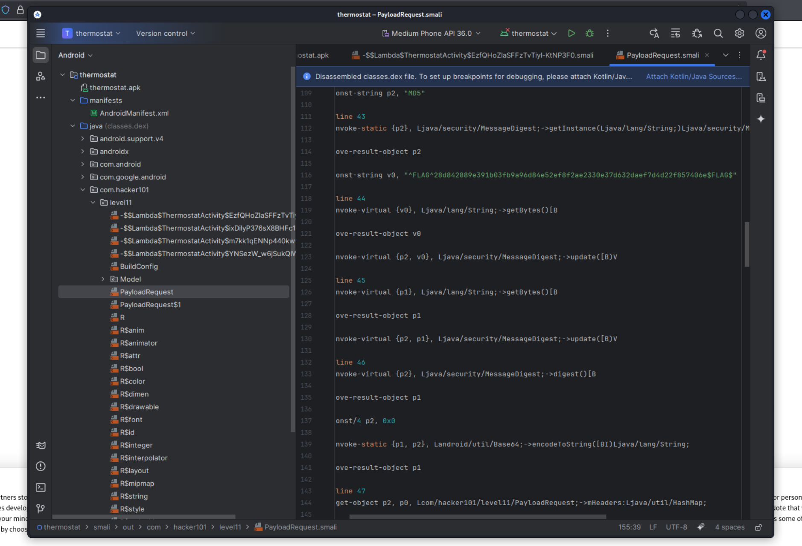

# Android CTF Challenge - Static Analysis
**Difficulty:** [Difficulty Level]  
**Category:** Mobile/Android  
**Flags:** 2/2

---

## 🧠 Thought Process
This challenge required static analysis of an Android APK file. Since mobile application security often involves examining the application's code structure, resources, and compiled bytecode, I knew I would need to use Android Studio to properly analyze the APK file and explore its contents.

The key insight was that flags in Android CTF challenges are commonly hidden in:
- Application source code files
- Resource files
- Configuration files
- Class files containing hardcoded strings

---

## 🔧 Step 1: Environment Setup
First, I needed to install Android Studio to properly analyze the APK file:

1. **Download Android Studio** from the official Android Developer website
2. **Install Android Studio** with the standard configuration
3. **Download the APK file** from the challenge website

---

## 📱 Step 2: Opening the APK in Android Studio
Once Android Studio was installed, I opened the APK file:

1. **Launch Android Studio**
2. **Open the APK file** in Profile or Debug mode
   - File → Profile or Debug APK
   - Navigate to the downloaded APK file
   - Select the APK and click "OK"

This allows Android Studio to decompile the APK and show its internal structure, including:
- Source code files
- Resources
- Manifest files
- Class files

---

## 🔍 Step 3: Exploring the Application Structure
After opening the APK, I began exploring the file structure systematically. Android Studio presented a tree view of the decompiled application, showing various folders and files.

The key was to look through different directories and files for anything that might contain flags or sensitive information.

---

## 🚩 Step 4: Flag Discovery
After exploring various directories, I found the flags in a specific location:

**Path:** `com.hacker101/level11/PayloadRequest`

Within the `PayloadRequest` file, I scrolled down through the content and discovered **both flags** embedded in the code.

The flags were likely hardcoded as strings within the `PayloadRequest` class, which is a common mistake in mobile application development where developers accidentally leave sensitive information in the source code.

---

## 🏁 Captured Flags
- **Flag 1:** Found in `PayloadRequest` file at `com.hacker101/level11/`
- **Flag 2:** Found in the same `PayloadRequest` file

---

## ✅ Summary
This challenge demonstrated the importance of **static analysis** in mobile application security:

1. **APK Decompilation:** Android Studio can easily decompile APK files to reveal source code
2. **Hardcoded Secrets:** Developers often accidentally leave sensitive information in source code
3. **File Structure Analysis:** Systematic exploration of the application structure is crucial
4. **Code Review:** Even compiled applications can reveal their secrets through proper analysis

---

## 🛠️ Tools Used
- **Android Studio** - For APK decompilation and analysis
- **APK File** - The target application from the challenge website

---

## 💡 Key Takeaways
- Never hardcode sensitive information (flags, API keys, passwords) in mobile applications
- Static analysis is a fundamental technique in mobile application security testing
- Android Studio provides excellent tools for reverse engineering Android applications
- Always examine class files and source code when performing security assessments

This challenge highlighted how easily secrets can be extracted from mobile applications through static analysis, emphasizing the importance of proper security practices in mobile development.

test