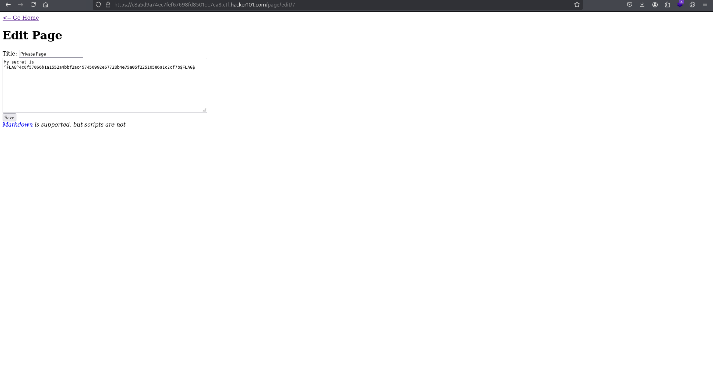
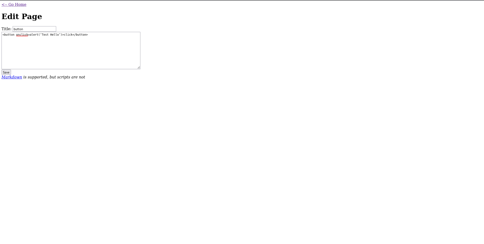
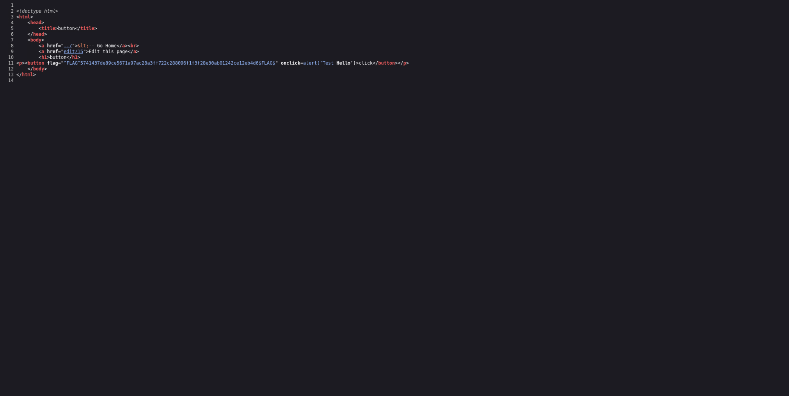

# EasyMicro-CMS v1 Web Security Challenge Writeup

**Difficulty:** Easy  
**Category:** Web Security  
**Flags:** 4/4  

---

## 🎯 Challenge Overview

This challenge involved exploiting vulnerabilities in a simple Content Management System (CMS). The goal was to find 4 hidden flags through various web security techniques including Cross-Site Scripting (XSS), SQL injection, and access control bypass.

---

## 🔍 Initial Reconnaissance

### Step 1: Source Code Analysis
First, I examined the website's source code to understand the application structure and identify potential attack vectors.


*Initial landing page of the CMS*


*Examining the source code for vulnerabilities*

The CMS appeared to be a simple page editor with basic functionality for creating and editing content pages.

---

## 🚩 Flag 1: Cross-Site Scripting (XSS)

### Discovery Process
After exploring the basic functionality, I noticed that the page editor allowed user input without proper sanitization. I decided to test for XSS vulnerabilities.

### Exploitation
I injected the following XSS payload into both the title and text fields:
```javascript
Test<script>alert(1);</script>
```

When I navigated back to the home page, the JavaScript executed successfully, indicating a stored XSS vulnerability.


*XSS payload execution revealing the first flag*

### 🏁 First Flag Captured
```
^FLAG^743d18cb6432bf139407ddab84514c9c41cc90767b4bec84d1a649b77868eb69$FLAG$
```

---

## 🚩 Flag 2: SQL Injection via URL Manipulation

### Discovery Process
While exploring the application, I noticed that editing pages changed the URL parameter (e.g., `id=1`, `id=2`). I observed that IDs 3-11 seemed to be missing, which suggested potential hidden content.

### Exploitation
I began testing for SQL injection by manipulating the URL parameters. When I added a single quote (`'`) to the URL parameter, the application behavior changed significantly.


*SQL injection attempt revealing database error and flag*

The quote mark triggered what appeared to be a SQL error, which inadvertently exposed the second flag.

### 🏁 Second Flag Captured
```
^FLAG^6f3cc44b1ec3f88ebb981476c4cb039e8ffb93e2c0f7148d78913c7f0f11e403$FLAG$
```

---

## 🚩 Flag 3: Access Control Bypass

### Discovery Process
Continuing my URL manipulation, I systematically tested different ID values:
- IDs 3-6: Returned "Not Found" errors
- ID 7: Returned "Forbidden - You don't have permission to access this resource"
- IDs 8-11: Similar forbidden errors
- ID 12: Showed a new accessible page

### Exploitation
The "Forbidden" message for ID 7 suggested that the page existed but had access restrictions. I tried accessing the edit functionality directly by navigating to the edit URL for ID 7.


*Forbidden access message for restricted content*


*Successfully bypassing access control to edit restricted page*

By directly accessing the edit endpoint, I was able to bypass the view restrictions and access the hidden content, which contained the third flag.

### 🏁 Third Flag Captured
```
^FLAG^4c0f57066b1a1552a4bbf2ac457450992e67720b4e75a05f22510586a1c2cf7b$FLAG$
```

---

## 🚩 Flag 4: JavaScript Injection in Markdown

### Discovery Process
While exploring a new page, I found a message stating: "Markdown is supported, but scripts are not." This seemed like a challenge to test the script filtering mechanisms.

### Exploitation
I decided to test if HTML/JavaScript could be embedded despite the warning. First, I tried a simple button:
```html
<input type="button" id="myButton" value="Click Me!">
```


*Creating a button element to test script execution*

The button was created successfully, but didn't execute any JavaScript. I then tried adding JavaScript functionality, but realized I had popup blockers enabled initially.


*Button successfully created in the page*

### Flag Discovery
Even though the JavaScript didn't execute visibly due to popup blockers, I checked the source code of the page after creating the button, similar to my approach with the first flag.


*Source code revealing the fourth flag*

The flag was embedded in the source code of the page containing the injected JavaScript.

### 🏁 Fourth Flag Captured
```
^FLAG^5741437de89ce5671a97ac28a3ff722c288096f1f3f28e30ab01242ce12eb4d6$FLAG$
```

---

## 📊 Summary of Vulnerabilities Found

| Vulnerability Type | Impact | Flag Location |
|-------------------|--------|---------------|
| **Stored XSS** | High - Script execution in user browsers | Page content after injection |
| **SQL Injection** | High - Database information disclosure | Error message response |
| **Access Control Bypass** | Medium - Unauthorized access to restricted content | Hidden page content |
| **Script Filter Bypass** | Medium - JavaScript injection despite filtering | Page source code |

---

## 🛡️ Recommended Fixes

1. **Input Sanitization**: Implement proper input validation and output encoding to prevent XSS
2. **Parameterized Queries**: Use prepared statements to prevent SQL injection
3. **Access Control**: Implement proper authorization checks on both view and edit endpoints
4. **Content Security Policy**: Implement CSP headers to prevent script injection
5. **Error Handling**: Avoid exposing sensitive information in error messages

---

## 🏆 Final Results
- **Total Flags:** 4/4
- **Challenge Completed:** ✅
- **Techniques Used:** XSS, SQL Injection, Access Control Bypass, Source Code Analysis

---

## 📝 Key Takeaways

This challenge demonstrated the importance of:
- Always checking source code for hidden information
- Testing for common web vulnerabilities systematically
- Understanding that security controls can often be bypassed through different attack vectors
- The principle that "security through obscurity" (like hiding page IDs) is not sufficient protection

The challenge provided excellent practice in identifying and exploiting common web application vulnerabilities in a controlled environment.