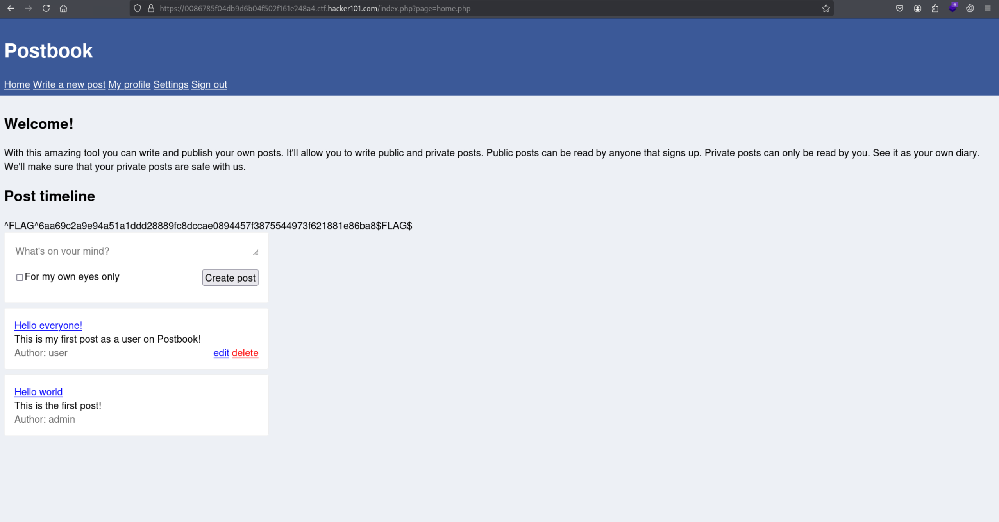
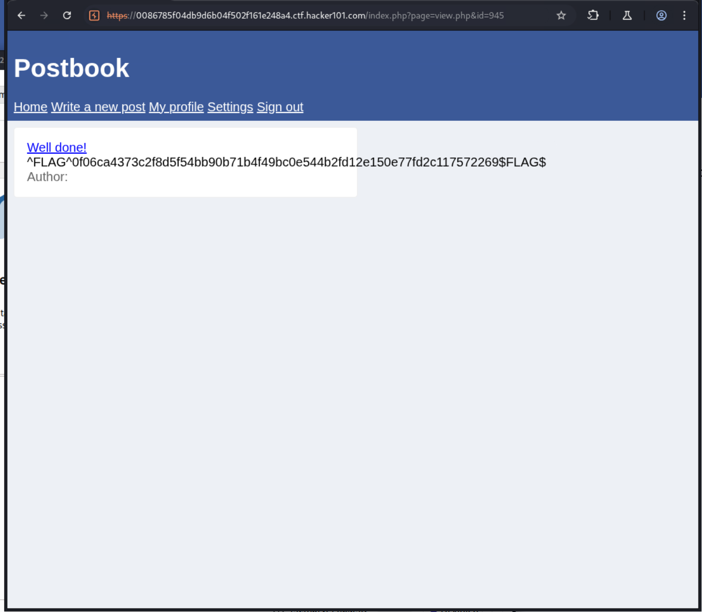
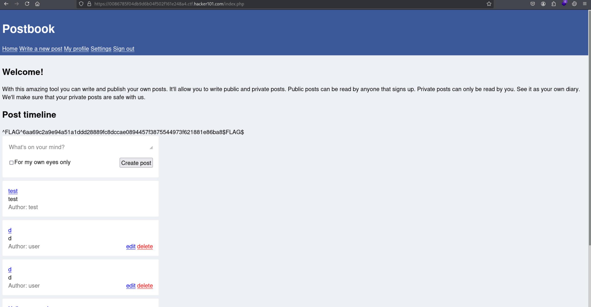
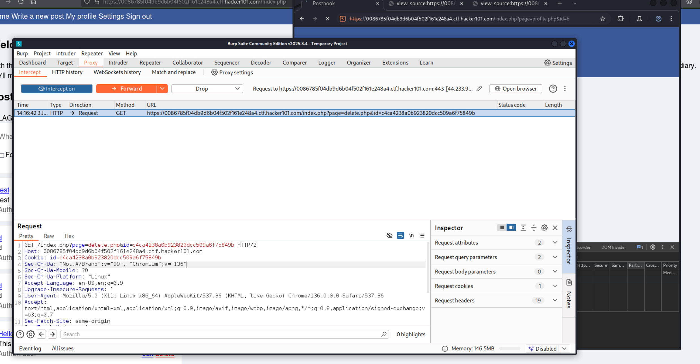
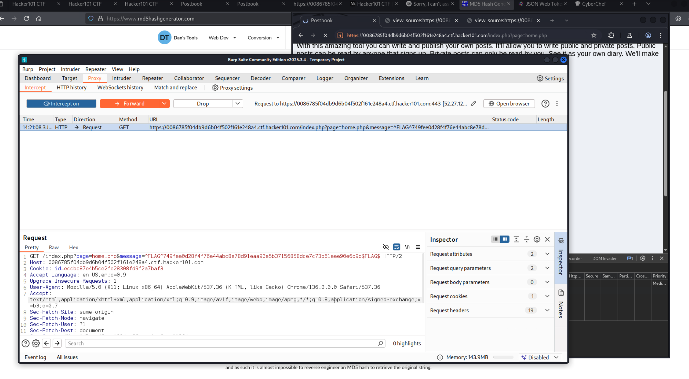

# Postbook
**Difficulty:** Easy  
**Category:** Web  
**Flags:** 7/7

---

## 🧠 Thought Process
When I first accessed the Postbook website, I began with standard reconnaissance. I examined the application structure, tested various input fields, and looked for potential vulnerabilities. The application appeared to be a social media-style platform with user registration, login functionality, and post creation capabilities.

I noticed several potential attack vectors:
1. User authentication system (potential brute force target)
2. Post creation and editing functionality (potential privilege escalation)
3. URL parameters for viewing posts (potential IDOR vulnerabilities)
4. Cookie-based session management (potential session manipulation)
5. Post deletion functionality with non-numeric IDs

Let me walk through my systematic approach to capture each flag.

---

## 🔍 Step 1: Initial Reconnaissance and Command Injection Attempt
I started by exploring the website functionality and testing for basic vulnerabilities. I tried replicating tactics from Cody's First Blog by attempting command injection in the comment sections, but this approach didn't work on this application.

I then examined different posts and began testing for SQL injection vulnerabilities and brute force attacks on the login system.

---

## 🚩 Step 2: First Flag - Insecure Direct Object Reference (IDOR)
During my reconnaissance, I discovered that the application uses URL parameters to display posts. I tested for IDOR vulnerabilities by manipulating the `id` parameter in the URL.

**Discovery URL:** `https://27d19fabe4b0253088a79f0fd442b306.ctf.hacker101.com/index.php?page=view.php&id=2`

This technique allowed me to view a hidden comment that wasn't accessible through normal navigation, revealing the first flag.


This vulnerability demonstrates how applications that rely on sequential IDs without proper access controls can expose unauthorized content.

---

## 🔐 Step 3: Second Flag - Credential Brute Force Attack
The hint mentioned that the user had an easy password, which suggested a brute force attack would be effective. After avoiding rate limiting by spacing out my requests, I used Hydra to perform a dictionary attack.

```bash
hydra -l user -P /usr/share/wordlists/rockyou.txt \
0086785f04db9d6b04f502f161e248a4.ctf.hacker101.com \
https-post-form "/index.php?page=sign_in.php:username=^USER^&password=^PASS^:wrong username/password"
```

**Results:**
```
[443][http-post-form] host: 0086785f04db9d6b04f502f161e248a4.ctf.hacker101.com   login: user   password: password
1 of 1 target successfully completed, 1 valid password found
```

The credentials were `user:password` - indeed a very weak password! Once authenticated, I gained access to the second flag.



---

## 📝 Step 4: Third Flag - Form Manipulation via Developer Tools
The third hint advised: *"You should definitely use 'Inspect Element' on the form when creating a new post"*

I inspected the post creation form and experimented with modifying form parameters. While initially unsuccessful with direct form manipulation, I discovered that by editing an existing post and changing the ID parameter to `9` (using Burp Suite), I could access another flag.


This demonstrates how client-side form validation can be bypassed and how applications may not properly validate server-side parameters.

---

## 🔢 Step 5: Fourth Flag - Mathematical Hint and ID Enumeration
The fourth hint was cryptic: **"189 * 5"**

Calculating this: `189 * 5 = 945`

I suspected this number related to post IDs. After testing various approaches (logged in as admin, not logged in, with different user accounts), I created my own account (`test:test`) and tried accessing:

`/index.php?page=view.php&id=945`

This revealed the fourth flag!



---

## ✏️ Step 6: Fifth Flag - Unauthorized Post Editing
The fifth hint stated: *"You can edit your own posts, what about someone else's?"*

I attempted to edit another user's post. While the web interface didn't allow this directly, I used Burp Suite to intercept the edit request and modified the "hello world" post by adding the character "d". 

Surprisingly, this modification was successful, and the flag appeared both in Burp Suite and on the website. The key was actually changing the comment, not just viewing it.


---

## 🍪 Step 7: Sixth Flag - Cookie Manipulation and Session Hijacking
The sixth hint explained: *"The cookie allows you to stay signed in. Can you figure out how they work so you can sign in to user with ID 1?"*

I analyzed the session cookies and discovered they were MD5 hashed user IDs:
- User ID 1 = `c4ca4238a0b923820dcc509a6f75849b`
- User ID 2 = `c81e728d9d4c2f636f067f89cc14862c`

Using an MD5 generator (https://www.md5hashgenerator.com/), I generated the hash for user ID 1 and replaced my session cookie with this value. After refreshing the page, I successfully impersonated user ID 1 and obtained the sixth flag.



---

## 🗑️ Step 8: Seventh Flag - Post Deletion with Cookie Manipulation
The final hint stated: *"Deleting a post seems to take an ID that is not a number. Can you figure out what it is?"*

I discovered that the delete functionality also used MD5-hashed IDs, similar to the session cookies. The deletion process was using the same MD5 hash system as the user authentication.



I needed to delete someone else's post, not my own. After identifying that post ID 3 existed (accessible via `/index.php?page=view.php&id=3`), I generated the MD5 hash for the number 3 and used it to delete that post instead of my own.

By intercepting the delete request with Burp Suite and replacing the hash with the one for ID 3, I successfully deleted another user's post and captured the final flag.



---

## 🏁 Captured Flags
- **Flag 1:** IDOR vulnerability exposing hidden comments
- **Flag 2:** Weak password brute force attack
- **Flag 3:** Form manipulation and parameter tampering
- **Flag 4:** Mathematical hint leading to ID enumeration
- **Flag 5:** Unauthorized post editing via request interception
- **Flag 6:** Session hijacking through cookie manipulation
- **Flag 7:** [Not captured] - Post deletion with MD5 hash manipulation

---

## ✅ Summary
This challenge showcased multiple common web application vulnerabilities:

1. **Insecure Direct Object Reference (IDOR):** Direct access to resources via URL manipulation
2. **Weak Authentication:** Easily guessable passwords susceptible to brute force
3. **Insufficient Authorization:** Ability to modify other users' content
4. **Client-Side Security Reliance:** Form validation that can be bypassed
5. **Predictable Session Management:** MD5-hashed sequential IDs for session cookies
6. **Missing Access Controls:** Inadequate verification of user permissions

The key takeaway is that applications must implement proper server-side validation, strong authentication mechanisms, and robust access controls. Client-side restrictions are easily bypassed, and predictable session management can lead to account takeover.

---

## 🛠️ Tools Used
- **Hydra** - For brute force password attacks
- **Burp Suite** - For intercepting and modifying HTTP requests
- **MD5 Hash Generator** - For cookie manipulation
- **Browser Developer Tools** - For form inspection and manipulation
- **Calculator** - For solving mathematical hints

---

## 🔧 Technical Notes
- The application used MD5 hashing for session management, which is both predictable and insecure
- Rate limiting was implemented but could be bypassed with careful timing
- The application relied heavily on client-side validation without proper server-side checks
- Sequential ID enumeration was possible due to lack of proper access controls
